## question1:
Créer un dossier appelé learn_git

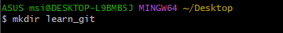 

## question2:
Cd (changer de répertoire) dans le dossier learn_git

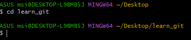

## question3:
Créer un fichier appelé third.txt.

## question4:
Initialiser un dépôt git vide

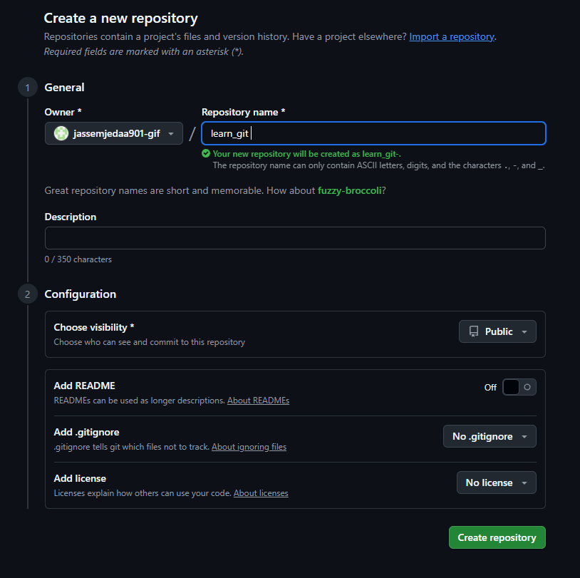

## question5:
Ajouter third.txt à la staging area

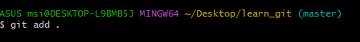

## question6:
Commiter avec le message "adding third.txt"

## question7:
Vérifier avec git log

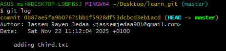

## question8:
Créez un autre fichier appelé fourth.txt

## question9:
Ajouter fourth.txt à la staging area

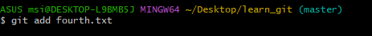

## question10:
Vérifiez avec le message "adding fourth.txt"

##  question11:
Enlevez le fichier third.txt
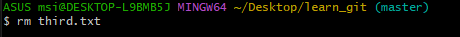

## question12:
Ajoutez cette modification à la staging area. En utilisant la commande "git add

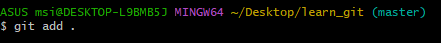

## question13:
Commiter avec le message "removing third.txt"

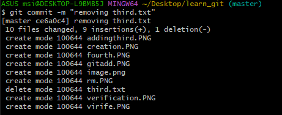

## question14:
Vérifiez vos commits en utilisant git log

## question15:
Changez vos paramètres globaux pour core.pager=cat - vous pouvez en savoir plus ici.

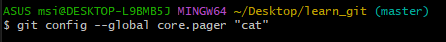

## question16:
Écrivez la commande appropriée pour lister toutes les configurations globales pour git sur votre machine.

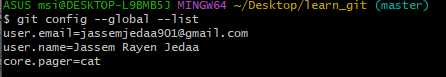